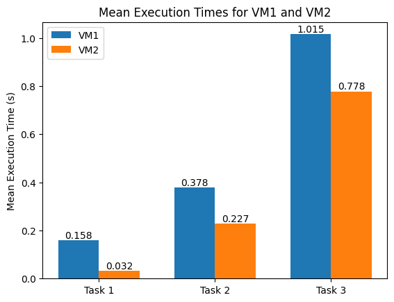
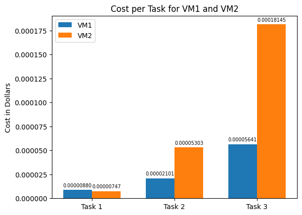

# GIK2NX - Lab 2 - Report

## Table of Contents

- [GIK2NX - Lab 2 - Report](#gik2nx---lab-2---report)
  - [Table of Contents](#table-of-contents)
  - [Introduction](#introduction)
  - [Method](#method)
    - [Code](#code)
      - [Task 1 - Find the value of x.](#task-1---find-the-value-of-x)
      - [Task 2 - Find the value of y](#task-2---find-the-value-of-y)
      - [Task 3 - Find the value of Z](#task-3---find-the-value-of-z)
  - [Results](#results)
    - [Task 1](#task-1)
    - [Task 2](#task-2)
    - [Task 3](#task-3)
  - [Discussion](#discussion)
  - [Conclusion](#conclusion)

## Introduction

In this lab, we will run the tasks from Lab 2 on two different Azure VMs and compare the execution times. We then discuss the results and calculate the performance difference between the two VMs and compare it to the difference in cost. We've made one modification to Task 3 in the lab instructions. We've increased the matrix size to 2500x2500 and increased the integer size to be randomized up to a max value of 9999 compared to the limit of 99 in the lab instructions. This was done to increase the execution time of the task to make it more heavy compared to Task 2.

## Method

The code for this lab is written in Python and uses the NumPy library for vectorized calculations. The code for each task is shown in the Code sub chapter.

The VMs used for this lab are the following:

- VM1: 2 cores, 4GB RAM, $0.20/hour
- VM2: 8 cores, 32GB RAM, $0.84/hour

After connecting to the Azure VM, we installed all of the prerequisites and cloned the repository with the code for the three tasks.

Install Python:

```powershell
Invoke-WebRequest -Uri "https://www.python.org/ftp/python/3.12.0/python-3.12.0-amd64.exe" -OutFile "python-installer.exe"; Start-Process -FilePath .\python-installer.exe -Args '/quiet InstallAllUsers=1 PrependPath=1' -Wait; Remove-Item -Path .\python-installer.exe
```

Then open a new PowerShell session and setup the rest of the prerequisites:

```powershell
python -m pip install --upgrade pip
pip install numpy
git clone https://github.com/sebdanielsson/gik2nx
cd gik2nx/lab2
```

We then ran each of the tasks 10 times one by one and calculated the mean execution time to run each script. The measurements were done using the `Measure-Command` cmdlet in PowerShell. The results are shown in the Results chapter.

Commands used to measure the execution time:

```powershell
(Measure-Command { python .\lab2-task1.py }).TotalSeconds
(Measure-Command { python .\lab2-task2.py }).TotalSeconds
(Measure-Command { python .\lab2-task3.py }).TotalSeconds
```

### Code

#### Task 1 - Find the value of x.

```python
def calculate_x(a, b):
    if not (0 <= a <= 9 and 0 <= b <= 9):
        raise ValueError("a and b must be positive integers less than 10.")
    x = a + b
    return x


a = 5
b = 7
x = calculate_x(a, b)

print(f"{x} = {a} + {b}")
```

#### Task 2 - Find the value of y

```python
import numpy as np

def calculate_y(a, b):
    a = np.array(a, dtype=np.float64)
    b = np.array(b, dtype=np.float64)

    # Check if elements in a and b are within the specified range
    if np.any(a >= 100) or np.any(b >= 100) or np.any(a <= 0) or np.any(b <= 0):
        raise ValueError("Elements in a and b must be positive integers less than 100.")

    # Ensure the length of a and b does not exceed n=50 and m=40 respectively
    if len(a) > 50 or len(b) > 40:
        raise ValueError("Length of array a must not exceed 50 and length of array b must not exceed 40.")

    # Calculate the first summation
    n = len(a)
    a_padded = np.pad(a, (0, max(0, n - len(a))), constant_values=0)[:n]
    b_padded = np.pad(b, (0, max(0, n - len(b))), constant_values=0)[:n]
    first_sum = np.sum((a_padded**4 + b_padded**2)**3)

    # Calculate the second summation
    m = len(b)
    a_padded_m = np.pad(a, (0, max(0, m - len(a))), constant_values=0)[:m]
    b_padded_m = np.pad(b, (0, max(0, m - len(b))), constant_values=0)[:m]
    second_sum = np.sum((a_padded_m**2 - b_padded_m)**2)

    # Return the sum of the two summations
    return first_sum + second_sum


# Generate random arrays for a and b with integers between 1 and 100
np.random.seed(1234)  # Set a seed for reproducibility
a = np.random.randint(1, 100, 50)
b = np.random.randint(1, 100, 40)

# Print a and b
# print(a)
# print(b)

# Calculate the result of the expression
result_with_large_numbers = calculate_y(a, b)
print("Result:", result_with_large_numbers)
```

#### Task 3 - Find the value of Z

```python
import numpy as np

matrix_rows = 2500
matrix_cols = 2500
integer_max = 10000

def calculate_z(A1, A2, B1, B2):
    if A1.shape != (matrix_rows, matrix_cols) or A2.shape != (matrix_rows, matrix_cols) or B1.shape != (matrix_rows, matrix_cols) or B2.shape != (matrix_rows, matrix_cols):
        raise ValueError("Dimensions of A1, A2, B1, and B2 must be ${matrix_rows}x${matrix_cols}.")
    if np.any(A1 >= integer_max) or np.any(A2 >= integer_max) or np.any(B1 >= integer_max) or np.any(B2 >= integer_max) or np.any(A1 <= 0) or np.any(A2 <= 0) or np.any(B1 <= 0) or np.any(B2 <= 0):
        raise ValueError("Elements in A1, A2, B1, and B2 must be positive integers less than ${integer_max}.")

    # Calculate Z1, Z2, and Z
    Z1 = A1 * B1
    Z2 = A2 * B2
    Z = Z1 + Z2
    return Z


np.random.seed(1234)  # Set a seed for reproducibility
A1 = np.random.randint(1, integer_max, (matrix_rows, matrix_cols))
A2 = np.random.randint(1, integer_max, (matrix_rows, matrix_cols))
B1 = np.random.randint(1, integer_max, (matrix_rows, matrix_cols))
B2 = np.random.randint(1, integer_max, (matrix_rows, matrix_cols))

# Calculate Z
Z = calculate_z(A1, A2, B1, B2)

# Print Z
print(Z)
```

## Results

### Task 1

| Run | VM1 ExecTime (s) | VM2 ExecTime (s) |
| --- | --------- | --------- |
| 1   | 0.1486903 | 0.0452988 |
| 2   | 0.1649746 | 0.0305155 |
| 3   | 0.1629312 | 0.0302494 |
| 4   | 0.1687515 | 0.0311018 |
| 5   | 0.1506248 | 0.0299361 |
| 6   | 0.1674121 | 0.0333507 |
| 7   | 0.1591185 | 0.0304545 |
| 8   | 0.1601762 | 0.0300453 |
| 9   | 0.1621312 | 0.0297539 |
| 10  | 0.139869  | 0.0296168 |

VM1 Mean Execution Time (s): 0.158
VM2 Mean Execution Time (s): 0.032

### Task 2

| Run | VM1 ExecTime (s) | VM2 ExecTime (s) |
| --- | --------- | --------- |
| 1   | 0.393761  | 0.2276371 |
| 2   | 0.3940874 | 0.2276515 |
| 3   | 0.3803838 | 0.2275164 |
| 4   | 0.3699331 | 0.228373  |
| 5   | 0.3600077 | 0.2260542 |
| 6   | 0.3671617 | 0.2232418 |
| 7   | 0.3496144 | 0.2210848 |
| 8   | 0.4015588 | 0.223877  |
| 9   | 0.3604963 | 0.2299135 |
| 10  | 0.4039447 | 0.2374321 |

VM1 Mean Execution Time (s): 0.378
VM2 Mean Execution Time (s): 0.227

### Task 3

| Run | VM1 ExecTime (s) | VM2 ExecTime (s) |
| --- | --------- | -------- |
| 1   | 1.0774044 | 0.776105 |
| 2   | 1.0498384 | 0.7736866 |
| 3   | 0.9824914 | 0.775299 |
| 4   | 1.0139454 | 0.7731951 |
| 5   | 1.0180805 | 0.7782635 |
| 6   | 0.9892987 | 0.7722598 |
| 7   | 1.0071994 | 0.7948794 |
| 8   | 1.0216969 | 0.7857238 |
| 9   | 0.9740818 | 0.7743415 |
| 10  | 1.0205213 | 0.7725996 |

VM1 Mean Execution Time (s): 1.015
VM2 Mean Execution Time (s): 0.778

### Plots





## Discussion

Looking at the result above, we can see that the VM with 8 cores and 32GB RAM is faster than the VM with 2 cores and 4GB RAM. The difference in execution time is larger for the tasks that require more computational power. The difference in execution time is 4.9x for task 1, 1.7x for task 2, and 1.3x for task 3. The difference in cost is 4.2x. This means that VM2 is just slightly more cost efficient to use for task 1 compared to VM1. For task 2 and 3, VM1 is considerably more cost efficient to use compared to VM2.

One reason for this falloff in cost-efficiency could be that the tasks are not utilizing multiple cores efficiently, thus the extra cores on VM2 are not being used to their full potential.

In a real world scenario one would also need to consider the cost of the idle time of the VMs. If the VMs are only used for a short period of time, the cost of the idle time could be higher than the cost of the actual execution time. In this case, VM1 would be more cost efficient to use for all three tasks since the cost of the idle time would be much lower.

## Conclusion

In this lab, we ran three tasks on two different Azure VMs and compared the execution times. We then discussed the results and calculated the performance difference between the two VMs and compared it to the difference in cost. We found that the VM with 8 cores and 32GB RAM is faster than the VM with 2 cores and 4GB RAM. The difference in execution time is smaller for the longer running tasks. One reason for this falloff in cost-efficiency could be that the tasks are not utilizing multiple cores efficiently, thus the extra cores on VM2 are not being used to their full potential. In a real world scenario one would also need to consider the cost of the idle time of the VMs. If the VMs are only used for a short period of time, the cost of the idle time could be higher than the cost of the actual execution time. In this case, VM1 would be more cost efficient to use for all three tasks since the cost of the idle time would be much lower.

An interesting change to the lab would be to run much longer tasks and see if the difference in execution time and cost-efficiency changes. Another interesting change would be to run some tasks that can utilize multiple cores efficiently and see if the difference in execution time and cost-efficiency changes.
